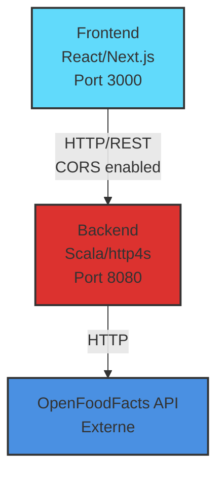
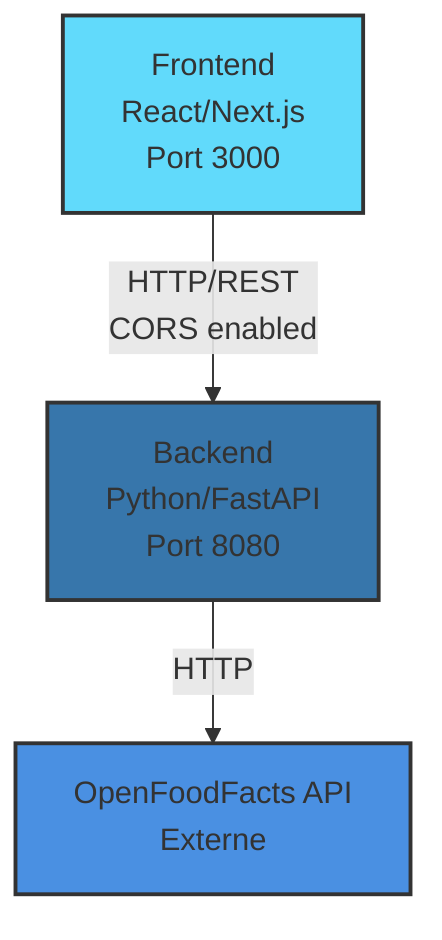
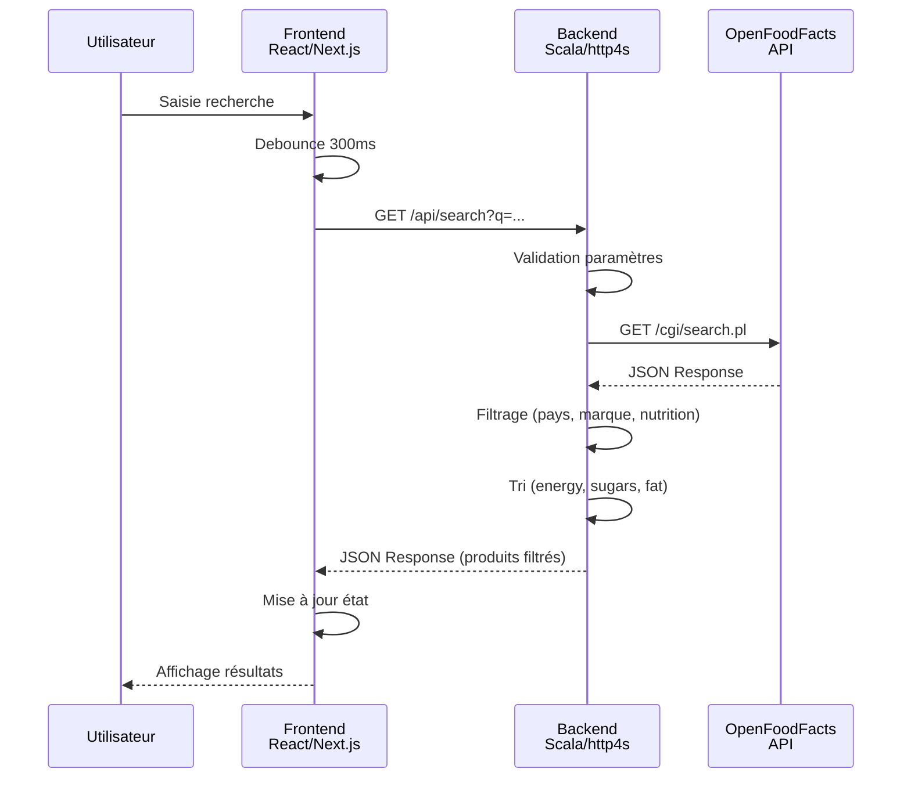
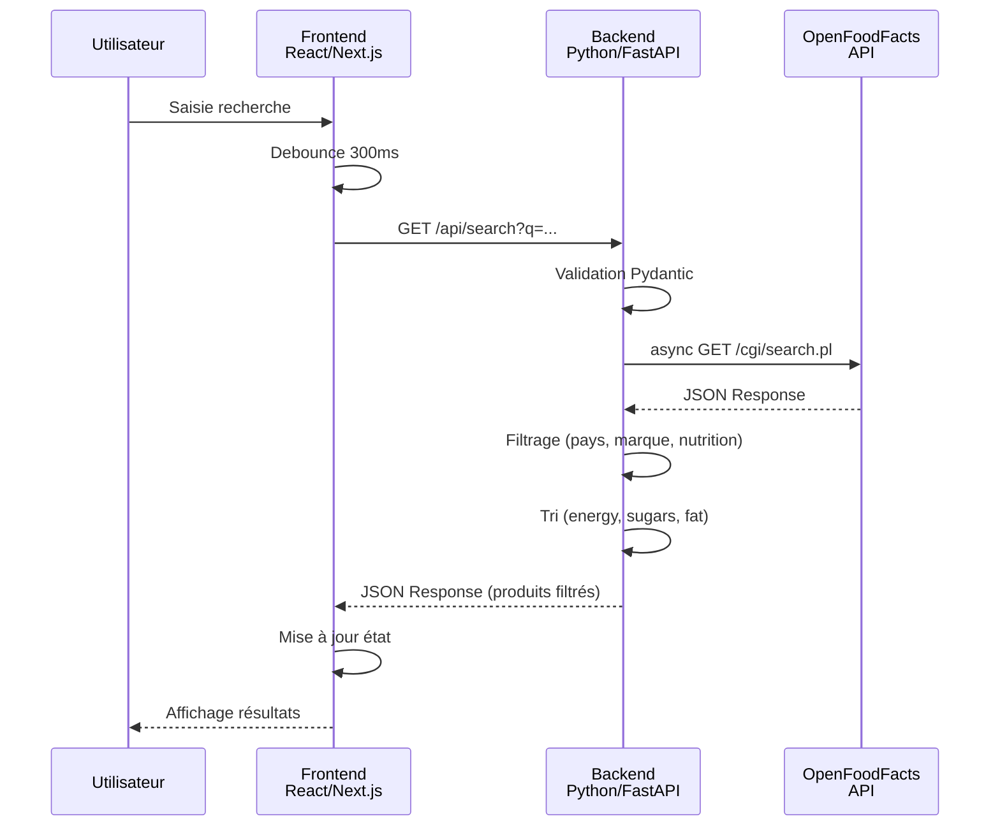
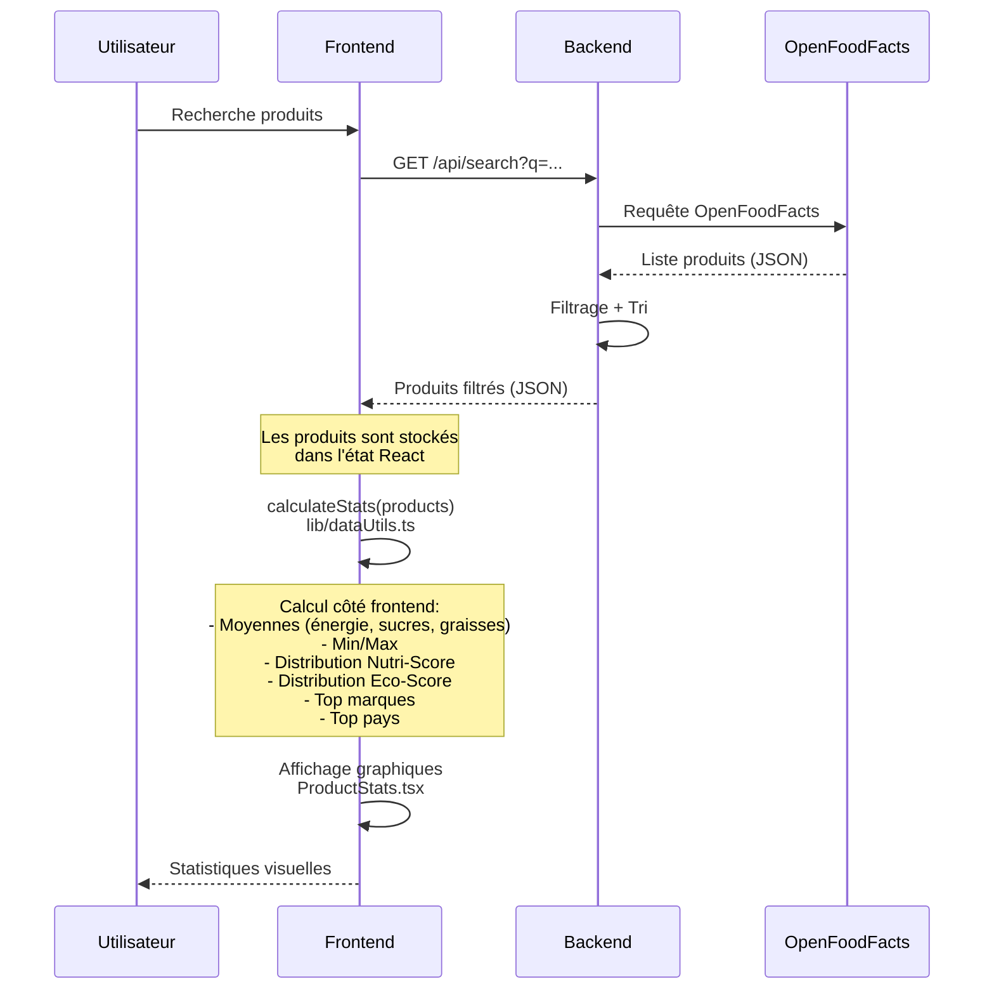
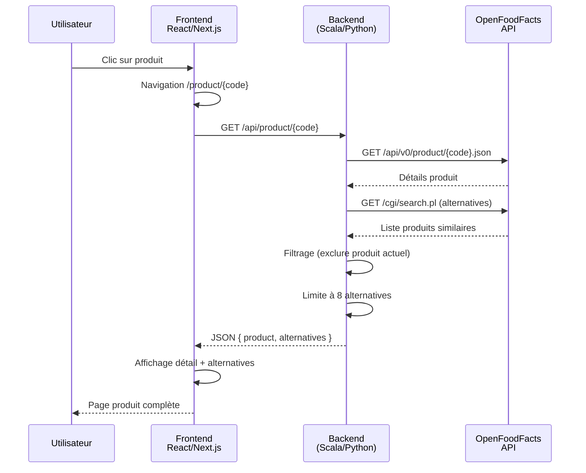
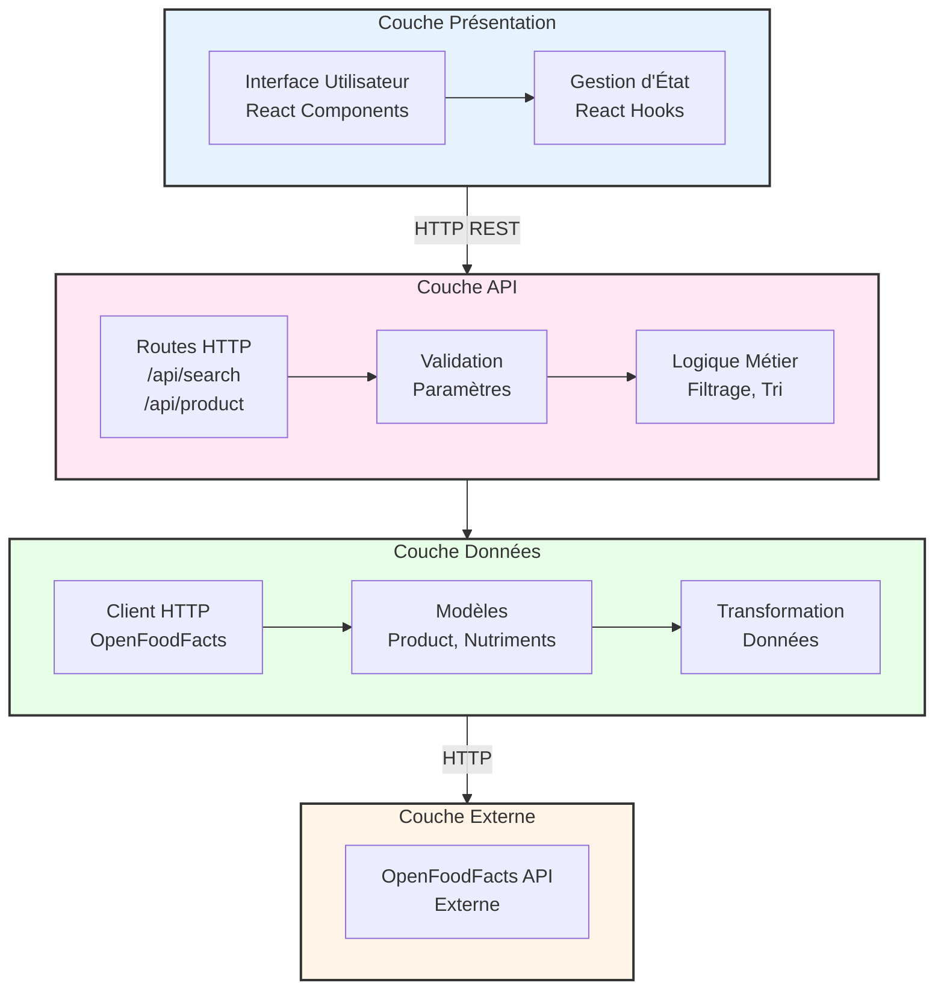
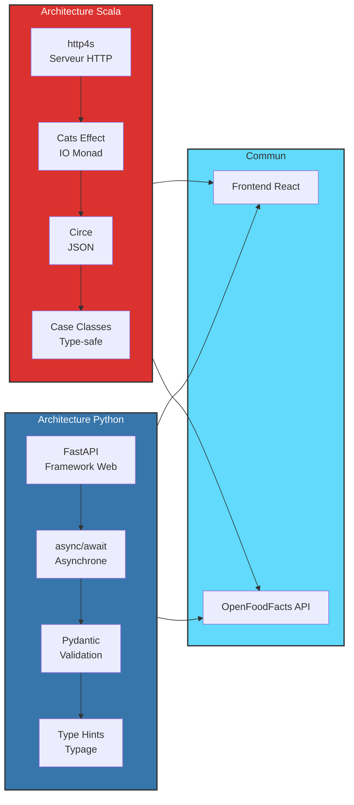

# 🏗️ Architecture Générale - FoodFact Application

## 📋 Table des matières

1. [Architecture Actuelle (Scala)](#architecture-actuelle-scala)
2. [Architecture Alternative (Python)](#architecture-alternative-python)
3. [Comparaison Détaillée](#comparaison-détaillée)
4. [Diagrammes d'Architecture](#diagrammes-darchitecture)

---

## 🎯 Architecture Actuelle (Scala)

### Vue d'ensemble

L'application FoodFact suit une architecture **client-serveur** avec séparation claire entre le frontend et le backend.



### 🏛️ Stack Technologique

#### Backend Scala

| Composant | Technologie | Version | Rôle |
|-----------|------------|---------|------|
| **Langage** | Scala | 3.3.1 | Langage de programmation fonctionnel |
| **Framework HTTP** | http4s | 0.23.26 | Serveur et client HTTP |
| **Effets** | Cats Effect | (via http4s) | Gestion asynchrone et effets |
| **JSON** | Circe | 0.14.6 | Sérialisation/désérialisation |
| **Build** | sbt | - | Gestionnaire de dépendances |
| **Logging** | Logback | 1.4.11 | Journalisation |

#### Frontend React

| Composant | Technologie | Rôle |
|-----------|------------|------|
| **Framework** | Next.js 14+ | Framework React avec App Router |
| **Langage** | TypeScript | Typage statique |
| **Styling** | Tailwind CSS | Styles utilitaires |
| **UI Components** | shadcn/ui | Composants réutilisables |
| **Graphiques** | Recharts | Visualisations de données |

### 📐 Architecture en Couches

#### 1. **Couche Présentation (Frontend)**

```
frontend_react/
├── app/                    # Pages Next.js (App Router)
│   ├── page.tsx           # Page principale (recherche)
│   └── product/[code]/    # Page détail produit
├── components/             # Composants React réutilisables
│   ├── ProductCard.tsx    # Carte produit
│   ├── DataTable.tsx      # Tableau de données
│   ├── ProductStats.tsx   # Statistiques
│   └── SearchFilters.tsx  # Filtres de recherche
└── lib/                    # Utilitaires et API
    ├── api.ts             # Appels HTTP vers backend
    ├── types.ts           # Types TypeScript
    └── dataUtils.ts       # Fonctions utilitaires
```

**Responsabilités :**
- Interface utilisateur (UI/UX)
- Gestion d'état local (React hooks)
- Appels API vers le backend
- **Calcul des statistiques** (côté frontend)
- Affichage et visualisation des données

#### 2. **Couche API (Backend Scala)**

```
backend_scala/
├── src/main/scala/
│   ├── Server.scala        # Point d'entrée + Routes HTTP
│   ├── OpenFoodClient.scala # Client HTTP pour OpenFoodFacts
│   └── Models.scala        # Modèles de données (case classes)
└── build.sbt              # Configuration et dépendances
```

**Responsabilités :**
- Exposition des endpoints REST (`/api/search`, `/api/product/{code}`)
- Validation des paramètres de requête
- Logique métier (filtrage, tri)
- Communication avec l'API OpenFoodFacts
- Transformation et normalisation des données
- Gestion CORS pour le frontend
- **Note : Les statistiques sont calculées côté frontend, pas côté backend**

#### 3. **Couche Données Externes**

- **OpenFoodFacts API** : Source de données principale
  - Endpoint de recherche : `https://world.openfoodfacts.org/cgi/search.pl`
  - Endpoint produit : `https://world.openfoodfacts.org/api/v0/product/{code}.json`

### 🔄 Flux de Données

#### Flux de Recherche

```
1. Utilisateur saisit une recherche
   ↓
2. Frontend (page.tsx) : Debounce 300ms
   ↓
3. Frontend (lib/api.ts) : Construit URL avec paramètres
   ↓
4. HTTP GET → http://localhost:8080/api/search?q=...
   ↓
5. Backend (Server.scala) : Route /api/search
   - Extraction des paramètres (q, country, brand, etc.)
   - Validation (q obligatoire)
   ↓
6. Backend (OpenFoodClient.scala) : rawSearch(query)
   - Requête HTTP vers OpenFoodFacts
   ↓
7. OpenFoodFacts API : Retourne JSON brut
   ↓
8. Backend (Server.scala) : 
   - Désérialisation JSON → SearchResponse
   - Filtrage (pays, marque, valeurs nutritionnelles)
   - Tri (energy, sugars, fat)
   ↓
9. Backend : Sérialisation → JSON réponse
   ↓
10. Frontend : Réception et mise à jour de l'état
    ↓
11. Frontend : Affichage (grille/tableau/statistiques)
```

#### Flux Détail Produit

```
1. Utilisateur clique sur un produit
   ↓
2. Frontend : Navigation vers /product/{code}
   ↓
3. Frontend (ProductClient.tsx) : getProduct(code)
   ↓
4. HTTP GET → http://localhost:8080/api/product/{code}
   ↓
5. Backend (Server.scala) : Route /api/product/{barcode}
   ↓
6. Backend : 
   - api.getProduct(barcode) → Détails produit
   - api.rawSearch(product_name) → Alternatives
   ↓
7. Backend : Combinaison { product, alternatives }
   ↓
8. Frontend : Affichage détail + alternatives
```

### 🎨 Patterns Architecturaux Utilisés

1. **Pattern MVC (Model-View-Controller)**
   - **Model** : `Models.scala` (case classes)
   - **View** : Composants React
   - **Controller** : `Server.scala` (routes + logique)

2. **Pattern Client-Server**
   - Frontend = Client
   - Backend = Serveur API REST

3. **Pattern Repository (implicite)**
   - `OpenFoodClient` agit comme un repository pour OpenFoodFacts

4. **Programmation Fonctionnelle**
   - Immutabilité (case classes)
   - Composition de fonctions
   - Gestion d'effets avec `IO` (Cats Effect)

5. **Type-Safe Routing**
   - http4s DSL pour routes typées
   - Extraction de paramètres avec types

### 🔒 Sécurité et Configuration

- **CORS** : Configuré pour autoriser le frontend
- **Validation** : Paramètre `q` obligatoire
- **Gestion d'erreurs** : Via `IO` et pattern matching
- **Pas d'authentification** : Application publique

---

## 🐍 Architecture Alternative (Python)

### Vue d'ensemble

Si l'application avait été développée en Python, l'architecture générale resterait similaire, mais avec des technologies Python spécifiques.



### 🏛️ Stack Technologique Python

#### Backend Python

| Composant | Technologie | Version | Rôle |
|-----------|------------|---------|------|
| **Langage** | Python | 3.10+ | Langage de programmation |
| **Framework HTTP** | FastAPI | 0.104+ | Framework web moderne et rapide |
| **Client HTTP** | httpx | 0.25+ | Client HTTP asynchrone |
| **Validation** | Pydantic | 2.5+ | Validation de données et modèles |
| **JSON** | (intégré) | - | Sérialisation native |
| **ASGI Server** | Uvicorn | 0.24+ | Serveur ASGI |
| **Logging** | logging | (stdlib) | Journalisation standard |

#### Frontend React
*(Identique à l'architecture Scala)*

### 📐 Architecture en Couches (Python)

#### 1. **Couche Présentation (Frontend)**
*(Identique à l'architecture Scala)*

#### 2. **Couche API (Backend Python)**

```
backend_python/
├── app/
│   ├── main.py              # Point d'entrée FastAPI
│   ├── routes/
│   │   ├── search.py        # Route /api/search
│   │   └── product.py       # Route /api/product/{code}
│   ├── services/
│   │   └── openfood_client.py # Client OpenFoodFacts
│   ├── models/
│   │   └── schemas.py        # Modèles Pydantic
│   └── utils/
│       └── filters.py        # Logique de filtrage
├── requirements.txt         # Dépendances Python
└── README.md
```

**Responsabilités :**
- Exposition des endpoints REST (FastAPI)
- Validation automatique avec Pydantic
- Logique métier (filtrage, tri)
- Communication avec OpenFoodFacts (httpx)
- Transformation des données

### 🔄 Flux de Données (Python)

#### Flux de Recherche (Python)

```
1. Utilisateur saisit une recherche
   ↓
2. Frontend : Debounce 300ms
   ↓
3. Frontend : Construit URL avec paramètres
   ↓
4. HTTP GET → http://localhost:8080/api/search?q=...
   ↓
5. Backend (main.py) : Route @app.get("/api/search")
   - FastAPI extrait automatiquement les paramètres
   - Validation Pydantic (q obligatoire)
   ↓
6. Backend (openfood_client.py) : async def raw_search(query)
   - Requête HTTP asynchrone avec httpx
   ↓
7. OpenFoodFacts API : Retourne JSON
   ↓
8. Backend (routes/search.py) :
   - Parsing JSON → Pydantic models
   - Filtrage (pays, marque, nutrition)
   - Tri (energy, sugars, fat)
   ↓
9. Backend : Sérialisation automatique Pydantic → JSON
   ↓
10. Frontend : Réception et affichage
```

### 📝 Exemple de Code Python

#### Structure Backend Python

```python
# app/main.py
from fastapi import FastAPI
from fastapi.middleware.cors import CORSMiddleware
from app.routes import search, product

app = FastAPI()

app.add_middleware(
    CORSMiddleware,
    allow_origins=["http://localhost:3000"],
    allow_credentials=True,
    allow_methods=["*"],
    allow_headers=["*"],
)

app.include_router(search.router, prefix="/api")
app.include_router(product.router, prefix="/api")
```

```python
# app/models/schemas.py
from pydantic import BaseModel, Field
from typing import Optional, List

class Nutriments(BaseModel):
    energy: Optional[float] = Field(None, alias="energy-kcal_100g")
    sugars: Optional[float] = Field(None, alias="sugars_100g")
    salt: Optional[float] = Field(None, alias="salt_100g")
    fat: Optional[float] = Field(None, alias="fat_100g")
    proteins: Optional[float] = Field(None, alias="proteins_100g")
    fiber: Optional[float] = Field(None, alias="fiber_100g")

class Product(BaseModel):
    code: str
    product_name: Optional[str] = None
    brands: Optional[str] = None
    categories: Optional[str] = None
    quantity: Optional[str] = None
    nutriscore_grade: Optional[str] = None
    ecoscore_grade: Optional[str] = None
    nova_group: Optional[int] = None
    ingredients_text: Optional[str] = None
    allergens: Optional[str] = None
    additives_tags: Optional[List[str]] = None
    labels: Optional[str] = None
    countries: Optional[str] = None
    image_url: Optional[str] = None
    image_small_url: Optional[str] = None
    image_front_url: Optional[str] = None
    nutriments: Optional[Nutriments] = None

class SearchResponse(BaseModel):
    count: int
    products: List[Product]
```

```python
# app/routes/search.py
from fastapi import APIRouter, Query, HTTPException
from app.models.schemas import SearchResponse
from app.services.openfood_client import OpenFoodClient

router = APIRouter()
client = OpenFoodClient()

@router.get("/search", response_model=SearchResponse)
async def search_products(
    q: str = Query(..., description="Terme de recherche"),
    country: Optional[str] = None,
    brand: Optional[str] = None,
    sortBy: Optional[str] = None,
    order: Optional[str] = None,
    minEnergy: Optional[float] = None,
    maxEnergy: Optional[float] = None,
    minSugar: Optional[float] = None,
    maxSugar: Optional[float] = None,
    minFat: Optional[float] = None,
    maxFat: Optional[float] = None,
):
    # Appel OpenFoodFacts
    response = await client.raw_search(q)
    
    # Filtrage
    filtered = filter_products(
        response.products,
        country=country,
        brand=brand,
        minEnergy=minEnergy,
        maxEnergy=maxEnergy,
        minSugar=minSugar,
        maxSugar=maxSugar,
        minFat=minFat,
        maxFat=maxFat,
    )
    
    # Tri
    sorted_products = sort_products(filtered, sortBy, order)
    
    return SearchResponse(
        count=len(sorted_products),
        products=sorted_products
    )
```

```python
# app/services/openfood_client.py
import httpx
from app.models.schemas import SearchResponse, ProductResponse

class OpenFoodClient:
    def __init__(self):
        self.base_url = "https://world.openfoodfacts.org"
        self.client = httpx.AsyncClient()
    
    async def raw_search(self, query: str) -> SearchResponse:
        url = f"{self.base_url}/cgi/search.pl"
        params = {
            "search_terms": query,
            "search_simple": "1",
            "action": "process",
            "json": "1",
            "page_size": "50",
            "fields": "code,product_name,brands,categories,..."
        }
        response = await self.client.get(url, params=params)
        response.raise_for_status()
        return SearchResponse(**response.json())
    
    async def get_product(self, barcode: str) -> Product:
        url = f"{self.base_url}/api/v0/product/{barcode}.json"
        response = await self.client.get(url)
        response.raise_for_status()
        data = response.json()
        return Product(**data["product"]) if data.get("product") else None
```

### 🎨 Patterns Architecturaux (Python)

1. **Pattern MVC**
   - **Model** : Pydantic models (`schemas.py`)
   - **View** : Composants React
   - **Controller** : FastAPI routes

2. **Pattern Client-Server**
   - Identique à Scala

3. **Pattern Repository**
   - `OpenFoodClient` comme repository

4. **Programmation Asynchrone**
   - `async/await` pour I/O non-bloquant
   - `httpx` pour requêtes HTTP asynchrones

5. **Dependency Injection**
   - FastAPI supporte nativement l'injection de dépendances

---

## ⚖️ Comparaison Détaillée

### 📊 Tableau Comparatif

| Aspect | Scala (Actuel) | Python (Alternative) |
|--------|----------------|---------------------|
| **Langage** | Scala 3.3.1 | Python 3.10+ |
| **Paradigme** | Fonctionnel + OOP | Orienté objet + fonctionnel |
| **Framework HTTP** | http4s 0.23.26 | FastAPI 0.104+ |
| **Client HTTP** | http4s Ember Client | httpx 0.25+ |
| **Validation** | Manuelle + Pattern Matching | Pydantic (automatique) |
| **JSON** | Circe (explicite) | Pydantic (intégré) |
| **Asynchrone** | Cats Effect IO | async/await natif |
| **Typage** | Statique fort | Statique (type hints) |
| **Performance** | Très élevée (JVM) | Élevée (interprété) |
| **Courbe d'apprentissage** | Raide | Douce |
| **Écosystème** | Spécialisé (JVM) | Très large |
| **Documentation API** | Manuelle | Auto-générée (Swagger) |
| **Gestion d'erreurs** | IO monad | Exceptions Python |
| **Build Tool** | sbt | pip/poetry |
| **Déploiement** | JAR (JVM) | Docker/Python runtime |

### 🔍 Analyse Détaillée

#### 1. **Performance**

**Scala (http4s) :**
- ✅ Compilé en bytecode JVM → Performance très élevée
- ✅ Gestion mémoire optimisée (GC JVM)
- ✅ Concurrence efficace avec Cats Effect
- ⚠️ Temps de démarrage plus long (JVM)

**Python (FastAPI) :**
- ✅ FastAPI est l'un des frameworks Python les plus rapides
- ✅ Asynchrone natif (async/await)
- ⚠️ Interprété → Plus lent que Scala pour CPU-intensive
- ✅ Démarrage rapide

**Verdict :** Scala est plus performant pour les calculs intensifs, mais FastAPI est très rapide pour les APIs REST.

#### 2. **Développement et Productivité**

**Scala :**
- ⚠️ Courbe d'apprentissage raide (programmation fonctionnelle)
- ⚠️ Syntaxe plus verbeuse pour certaines opérations
- ✅ Type-safety très forte (moins de bugs à l'exécution)
- ✅ Refactoring sûr grâce au typage

**Python :**
- ✅ Syntaxe simple et lisible
- ✅ Courbe d'apprentissage douce
- ✅ Développement rapide (prototypage)
- ✅ Documentation auto-générée (Swagger UI)
- ⚠️ Type hints optionnels (moins de sécurité)

**Verdict :** Python est plus productif pour le développement rapide, Scala pour la robustesse à long terme.

#### 3. **Validation et Sérialisation**

**Scala (Circe) :**
```scala
// Décodage personnalisé nécessaire
given Decoder[Nutriments] = new Decoder[Nutriments] {
  def apply(c: HCursor): Decoder.Result[Nutriments] = ...
}
```
- ⚠️ Code plus verbeux
- ✅ Contrôle total sur la désérialisation
- ✅ Type-safe à la compilation

**Python (Pydantic) :**
```python
class Nutriments(BaseModel):
    energy: Optional[float] = Field(None, alias="energy-kcal_100g")
```
- ✅ Déclaration simple et concise
- ✅ Validation automatique
- ✅ Documentation auto-générée
- ✅ Messages d'erreur clairs

**Verdict :** Pydantic est plus simple et expressif pour la validation.

#### 4. **Gestion Asynchrone**

**Scala (Cats Effect IO) :**
```scala
api.rawSearch(query).flatMap { resp =>
  // Traitement
  Ok(result.asJson)
}
```
- ✅ Composition fonctionnelle
- ✅ Gestion d'erreurs explicite
- ⚠️ Courbe d'apprentissage (monads)

**Python (async/await) :**
```python
response = await client.raw_search(query)
# Traitement
return result
```
- ✅ Syntaxe intuitive
- ✅ Facile à comprendre
- ✅ Natif au langage

**Verdict :** Python est plus accessible pour l'asynchrone.

#### 5. **Écosystème et Bibliothèques**

**Scala :**
- ✅ Écosystème JVM (accès à toutes les libs Java)
- ⚠️ Moins de libs spécifiques Scala
- ✅ Bibliothèques de qualité (typelevel)

**Python :**
- ✅ Écosystème énorme (PyPI)
- ✅ Bibliothèques pour tout
- ✅ Communauté très active
- ✅ Intégration facile avec ML/Data Science

**Verdict :** Python a un écosystème plus large.

#### 6. **Documentation API**

**Scala (http4s) :**
- ⚠️ Documentation manuelle nécessaire
- ⚠️ Pas de génération automatique
- ✅ Contrôle total

**Python (FastAPI) :**
- ✅ Documentation auto-générée (Swagger/OpenAPI)
- ✅ Interface interactive (/docs)
- ✅ Validation des schémas automatique

**Verdict :** FastAPI gagne clairement pour la documentation.

#### 7. **Maintenance et Évolutivité**

**Scala :**
- ✅ Type-safety réduit les bugs
- ✅ Refactoring sûr
- ⚠️ Moins de développeurs Scala disponibles
- ✅ Performance stable à grande échelle

**Python :**
- ✅ Beaucoup de développeurs disponibles
- ✅ Maintenance facile (code lisible)
- ⚠️ Moins de sécurité de types
- ✅ Évolutivité avec async

**Verdict :** Scala pour la robustesse, Python pour la maintenabilité.

### 📈 Recommandations par Cas d'Usage

#### Choisir Scala si :
- ✅ Performance critique
- ✅ Système à grande échelle
- ✅ Équipe expérimentée en programmation fonctionnelle
- ✅ Besoin de type-safety maximale
- ✅ Intégration avec écosystème JVM

#### Choisir Python si :
- ✅ Développement rapide (MVP, prototype)
- ✅ Équipe moins expérimentée
- ✅ Besoin de documentation API automatique
- ✅ Intégration avec ML/Data Science
- ✅ Écosystème large requis

### 🎯 Conclusion

**Architecture Scala (Actuelle) :**
- ✅ Performance supérieure
- ✅ Type-safety maximale
- ✅ Robuste et scalable
- ⚠️ Courbe d'apprentissage plus raide

**Architecture Python (Alternative) :**
- ✅ Développement plus rapide
- ✅ Documentation auto-générée
- ✅ Plus accessible
- ⚠️ Performance légèrement inférieure

**Les deux architectures sont valides** et peuvent répondre aux besoins de l'application FoodFact. Le choix dépend des priorités de l'équipe et du projet.

---

## 📐 Diagrammes d'Architecture

### Diagramme de Séquence - Recherche (Scala)



### Diagramme de Séquence - Recherche (Python)



### Diagramme de Composants (Scala)

```mermaid
graph TB
    subgraph Frontend["Frontend React (Port 3000)"]
        Pages[Pages<br/>page.tsx<br/>product/[code]]
        Components[Components<br/>ProductCard<br/>DataTable<br/>ProductStats]
        API[lib/api.ts<br/>Appels HTTP]
        Pages --> Components
        Components --> API
    end
    
    subgraph Backend["Backend Scala (Port 8080)"]
        Server[Server.scala<br/>Routes HTTP<br/>/api/search<br/>/api/product]
        Client[OpenFoodClient.scala<br/>Client HTTP]
        Models[Models.scala<br/>Case Classes<br/>Product, Nutriments]
        Server --> Client
        Server --> Models
        Client --> Models
    end
    
    subgraph External["Externe"]
        OFF[OpenFoodFacts API<br/>world.openfoodfacts.org]
    end
    
    API -->|HTTP REST| Server
    Client -->|HTTP| OFF
    
    style Frontend fill:#61dafb,stroke:#333,stroke-width:2px
    style Backend fill:#dc322f,stroke:#333,stroke-width:2px
    style External fill:#4a90e2,stroke:#333,stroke-width:2px
```

### Diagramme de Composants (Python)

```mermaid
graph TB
    subgraph Frontend["Frontend React (Port 3000)"]
        Pages[Pages<br/>page.tsx<br/>product/[code]]
        Components[Components<br/>ProductCard<br/>DataTable<br/>ProductStats]
        API[lib/api.ts<br/>Appels HTTP]
        Pages --> Components
        Components --> API
    end
    
    subgraph Backend["Backend Python (Port 8080)"]
        Routes[routes/<br/>search.py<br/>product.py]
        Services[services/<br/>openfood_client.py<br/>httpx async]
        Models[models/<br/>schemas.py<br/>Pydantic Models]
        Routes --> Services
        Routes --> Models
        Services --> Models
    end
    
    subgraph External["Externe"]
        OFF[OpenFoodFacts API<br/>world.openfoodfacts.org]
    end
    
    API -->|HTTP REST| Routes
    Services -->|HTTP async| OFF
    
    style Frontend fill:#61dafb,stroke:#333,stroke-width:2px
    style Backend fill:#3776ab,stroke:#333,stroke-width:2px
    style External fill:#4a90e2,stroke:#333,stroke-width:2px
```

### 🔍 Algorithmes de Matching

L'application utilise plusieurs algorithmes de matching pour filtrer et rechercher les produits :

#### 1. **Algorithme de Matching de Pays** (Le plus sophistiqué)

**Localisation :** `Server.scala` - Fonction `countryMatches()`

**Objectif :** Reconnaître un pays même avec différentes écritures (français, anglais, abréviations, formats OpenFoodFacts)

**Algorithme :**

```mermaid
flowchart TD
    Start[Pays recherché<br/>ex: 'France'] --> Normalize[Normalisation<br/>normalizeCountry]
    Normalize --> Variants{Génération<br/>variantes}
    Variants --> V1[france]
    Variants --> V2[fr]
    Variants --> V3[en:france]
    Variants --> V4[fr:france]
    Variants --> V5[en:fr]
    Variants --> V6[fr:fr]
    
    Product[Pays du produit<br/>ex: 'en:france,fr,belgium'] --> Split[Split par<br/>', ; | \\n espace']
    Split --> Clean[Nettoyage<br/>Supprime en: fr:]
    Clean --> Compare[Comparaison<br/>chaque partie]
    
    V1 --> Compare
    V2 --> Compare
    V3 --> Compare
    V4 --> Compare
    V5 --> Compare
    V6 --> Compare
    
    Compare --> Match{Match trouvé?}
    Match -->|Oui| True[Produit inclus]
    Match -->|Non| False[Produit exclu]
    
    style Start fill:#E6F3FF,stroke:#333,stroke-width:2px
    style Product fill:#FFE6F3,stroke:#333,stroke-width:2px
    style Match fill:#E6FFE6,stroke:#333,stroke-width:2px
    style True fill:#90EE90,stroke:#333,stroke-width:2px
    style False fill:#FFB6C1,stroke:#333,stroke-width:2px
```

**Code Scala :**
```scala
// Dictionnaire de variantes par pays
private val countryVariants: Map[String, Set[String]] = Map(
  "france" -> Set("france", "fr", "en:france", "fr:france", "en:fr", "fr:fr"),
  "belgium" -> Set("belgique", "belgium", "be", "en:belgium", "fr:belgique", ...),
  // ... autres pays
)

// Normalisation : transforme "France" en toutes ses variantes possibles
private def normalizeCountry(country: String): Set[String] = {
  val lower = country.toLowerCase.trim
  countryVariants.getOrElse(lower, Set(lower, s"en:$lower", s"fr:$lower"))
}

// Matching : vérifie si un produit contient le pays recherché
private def countryMatches(countriesStr: String, searchCountry: String): Boolean = {
  val searchVariants = normalizeCountry(searchCountry)
  
  // Sépare les pays du produit (ex: "en:france,fr,belgium")
  val countryParts = countriesStr.toLowerCase
    .split(Array(',', ';', '|', '\n', ' '))
    .map(_.trim.replaceAll("^(en|fr):", ""))
    .filter(_.nonEmpty)
  
  // Compare chaque partie avec chaque variante
  countryParts.exists(part =>
    searchVariants.exists(variant =>
      part == variant.replaceAll("^(en|fr):", "")
    )
  )
}
```

**Exemples :**
- Recherche `country=France` → Match avec produits ayant `"france"`, `"fr"`, `"en:france"`, `"fr:france"`, etc.
- Recherche `country=fr` → Match avec `"france"`, `"fr"`, `"en:fr"`, etc.
- Recherche `country=Belgium` → Match avec `"belgium"`, `"belgique"`, `"be"`, `"en:belgium"`, etc.

**Complexité :** O(n × m) où n = nombre de pays dans le produit, m = nombre de variantes

#### 2. **Algorithme de Matching de Marque**

**Localisation :** `Server.scala` - Filtre par marque

**Algorithme :** Matching par sous-chaîne (case-insensitive)

```scala
.filter(p => maybeBrand.forall(b =>
  p.brands.exists(_.toLowerCase.contains(b.toLowerCase))
))
```

**Exemples :**
- Recherche `brand=coca` → Match avec `"Coca-Cola"`, `"Coca Cola"`, `"coca"`, etc.
- Recherche `brand=nes` → Match avec `"Nestlé"`, `"Nesquik"`, etc.

**Complexité :** O(n × m) où n = nombre de produits, m = longueur moyenne des chaînes

#### 3. **Algorithme de Filtrage Nutritionnel**

**Localisation :** `Server.scala` - Filtres min/max

**Algorithme :** Comparaisons numériques simples

```scala
.filter(p => minEnergy.forall(min =>
  p.nutriments.flatMap(_.energy).exists(_ >= min)
))
.filter(p => maxEnergy.forall(max =>
  p.nutriments.flatMap(_.energy).exists(_ <= max)
))
```

**Logique :**
- Filtre par plage : `minEnergy <= énergie <= maxEnergy`
- Appliqué pour : énergie, sucres, graisses
- Utilise `Option` pour gérer les valeurs manquantes

**Complexité :** O(n) où n = nombre de produits

#### 4. **Algorithme de Recherche d'Alternatives**

**Localisation :** `Server.scala` - Route `/api/product/{code}`

**Algorithme :** Recherche par nom de produit

```scala
alternatives <- api.rawSearch(product.product_name.getOrElse(""))
  .map(_.products.filter(_.code != barcode).take(8))
```

**Logique :**
1. Récupère le nom du produit principal
2. Effectue une recherche OpenFoodFacts avec ce nom
3. Filtre pour exclure le produit actuel (`code != barcode`)
4. Limite à 8 alternatives

**Limitation :** Simple recherche textuelle, pas de calcul de similarité sémantique

**Complexité :** O(n) où n = nombre de résultats de recherche

#### 5. **Algorithme de Tri**

**Localisation :** `Server.scala` - Tri des résultats

**Algorithme :** Tri par clé avec ordre ascendant/descendant

```scala
val sorted = (maybeSortBy, maybeOrder) match {
  case (Some("energy"), Some("desc")) =>
    filtered.sortBy(_.nutriments.flatMap(_.energy)).reverse
  case (Some("energy"), _) =>
    filtered.sortBy(_.nutriments.flatMap(_.energy))
  // ... autres cas (sugars, fat)
}
```

**Complexité :** O(n log n) où n = nombre de produits filtrés

### 📊 Comparaison des Algorithmes

| Algorithme | Type | Complexité | Sophistication |
|------------|------|------------|----------------|
| **Matching Pays** | Normalisation + Comparaison | O(n × m) | ⭐⭐⭐⭐⭐ Très sophistiqué |
| **Matching Marque** | Sous-chaîne | O(n × m) | ⭐⭐ Simple |
| **Filtrage Nutrition** | Comparaison numérique | O(n) | ⭐ Simple |
| **Alternatives** | Recherche textuelle | O(n) | ⭐⭐ Basique |
| **Tri** | Sort par clé | O(n log n) | ⭐⭐ Standard |

### 🎯 Points d'Amélioration Possibles

1. **Matching de Marque :**
   - Ajouter support des synonymes (ex: "Coca" = "Coca-Cola")
   - Utiliser fuzzy matching (Levenshtein distance)

2. **Recherche d'Alternatives :**
   - Calculer la similarité nutritionnelle
   - Utiliser les catégories pour trouver des alternatives plus pertinentes
   - Score de similarité basé sur plusieurs critères

3. **Matching de Pays :**
   - Support automatique de plus de pays
   - Détection de langue automatique

### 📊 Calcul des Statistiques - Architecture Frontend

**Important : Les statistiques sont calculées entièrement côté frontend, pas côté backend.**

#### Flux de Calcul des Statistiques



#### Détails Techniques

**Fichier : `lib/dataUtils.ts`**
- Fonction `calculateStats(products: Product[]): ProductStats`
- Calcule toutes les statistiques en parcourant le tableau de produits
- Utilise `useMemo` pour optimiser les recalculs

**Fichier : `components/ProductStats.tsx`**
- Reçoit les produits en props
- Appelle `calculateStats(products)` via `useMemo`
- Affiche les graphiques avec Recharts

**Avantages de cette approche :**
- ✅ Pas de charge supplémentaire sur le backend
- ✅ Statistiques réactives (mise à jour instantanée)
- ✅ Calculs optimisés avec `useMemo`
- ✅ Pas besoin d'endpoint dédié pour les stats

**Inconvénients :**
- ⚠️ Calculs effectués sur le navigateur (peut être lent avec beaucoup de produits)
- ⚠️ Consommation mémoire côté client

### Diagramme de Séquence - Détail Produit



### Diagramme de Flux de Données - Architecture Complète

```mermaid
flowchart TD
    Start([Utilisateur]) --> Search{Action}
    
    Search -->|Recherche| SearchFlow[Barre de recherche]
    Search -->|Détail| DetailFlow[Clic sur produit]
    
    SearchFlow --> Debounce[Debounce 300ms]
    Debounce --> BuildURL[Construction URL<br/>avec paramètres]
    BuildURL --> APISearch[GET /api/search]
    
    DetailFlow --> Navigate[Navigation<br/>/product/{code}]
    Navigate --> APIDetail[GET /api/product/{code}]
    
    APISearch --> Backend[Backend<br/>Validation + Logique]
    APIDetail --> Backend
    
    Backend --> Filter[Filtrage<br/>Pays, Marque, Nutrition]
    Filter --> Sort[Tri<br/>Energy, Sugars, Fat]
    Sort --> External[Appel OpenFoodFacts]
    
    External --> Response[JSON Response]
    Response --> Transform[Transformation<br/>des données]
    Transform --> JSON[JSON final]
    
    JSON --> Frontend[Frontend<br/>Mise à jour état]
    Frontend --> Display[Affichage<br/>Grille/Tableau/Stats]
    Display --> End([Résultat visible])
    
    style Start fill:#90EE90,stroke:#333,stroke-width:2px
    style End fill:#90EE90,stroke:#333,stroke-width:2px
    style Backend fill:#FFB6C1,stroke:#333,stroke-width:2px
    style External fill:#87CEEB,stroke:#333,stroke-width:2px
    style Frontend fill:#61dafb,stroke:#333,stroke-width:2px
```

### Diagramme d'Architecture en Couches



### Diagramme Comparatif Scala vs Python



---

## 📚 Références

- [Documentation http4s](https://http4s.org/)
- [Documentation FastAPI](https://fastapi.tiangolo.com/)
- [Documentation Cats Effect](https://typelevel.org/cats-effect/)
- [Documentation Pydantic](https://docs.pydantic.dev/)
- [OpenFoodFacts API](https://world.openfoodfacts.org/data)

---

**Document créé le :** 2025-01-07  
**Version :** 1.0.0
